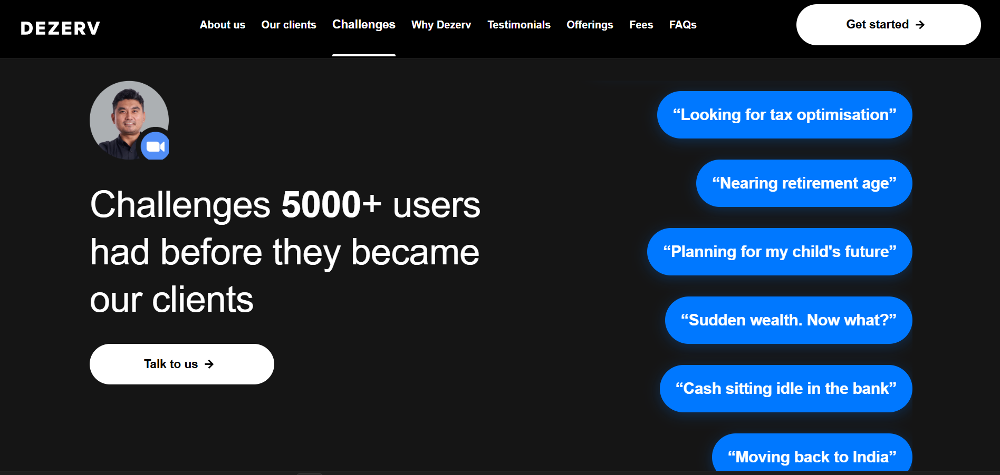
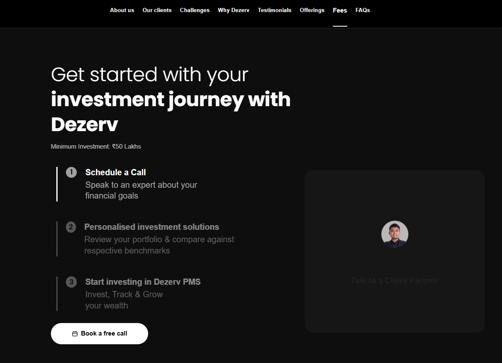

investally homepage flow change

> sebi regisered on top left on hero page. (instead of "Trusted by Smart Investors Across India" we want "Sebi Registered" or something of that sort)

> shift the signals on top as a small line (the signals which are just below the hero sections for should be shifted at the top of hero section which are flowing toward right)

> like dezerve.in -> challenges they solve  
just like deserve we should have some intreguiing questions our target customers would have we can solve. 

> why choose investally section update similar to deserve : 

> book an appointment : cal.com for scheduling and mobile number is required for booking. 

> philosophy: we would like to change the "Our Investment Philosophy" section in such a way that overall we have 4 values but they somehow include folloiwng... please suggest based on current values and these values.. which are best valuse to be kept (most impactfull), how should it be written.. and the exact points on those we woud also like to add how we are adding value in client life, so how do we incorporate it there?
   - fund manager due diligence. we Don't track only EMC (also add it in value addition - how we add value)
   - continuous review(also in add value) - not one time relationship but long term (some how add it on face of website as well - highlight it)
   - keep total 4 values. 
   - quaterly portfolio review.. market updates recurring/montly 
   - IPO investment recommendations. 

> we want to add user journey as well.. following are some points we may include in it. (sample : )
    > book call
    > portfolio review, benchmark and goal setting or (something like that)
    > Start investing via PMS and track all your things
    > quaterly reviews and market updates
    > insurance loan all it one platform with tax saving and minimal fee
    > your tax management along with it.  

> some miscelious points (we need to add these but where should we add it, that is not sure, help me where should we add these points in what manner?)
   > wholistic view via centricity board, for the user. 
   > tax reports
   > capital gain reports. 
   > do it for whole family 

> insurance certificate to be added (will be provided soon)
> youtube (link to be provided) symbol and linkedin (https://www.linkedin.com/company/investallyindia/)